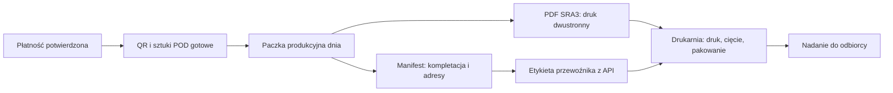

# Dzienne paczki produkcyjne POD

## Cel

Jedna paczka produkcyjna zbiera opłacone zamówienia z danego dnia. Zamiast przekazywać drukarni osobne pliki dla każdego zamówienia, administrator pobiera:

1. Jeden łączony PDF SRA3 z frontami i rewersami Podróżówek oraz kodami QR.
2. Manifest kompletacyjny z jednym blokiem na każde zamówienie.

Manifest zawiera liczbę Podróżówek, metodę doręczenia, dane odbiorcy albo dane punktu odbioru. Nie jest etykietą przewoźnika i nie zawiera kodów QR Podróżówek.

## Przepływ

## Zachowanie panelu administratora

- Przycisk **Utwórz paczkę z dzisiejszych opłaconych** zbiera wyłącznie zamówienia opłacone tego dnia w strefie Europe/Warsaw, które mają gotowe zadanie QR.
- Zamówienia bez kompletu QR nie są dodawane. Panel zwraca ich numery jako pominięte.
- Z poziomu paczki można pobrać osobno PDF produkcyjny SRA3 i manifest wysyłek.
- Status paczki przechodzi z `queued` na `sent_to_printer` dopiero po faktycznym przekazaniu materiałów drukarni.
- Miasto odbiorcy nie jest statusem zamówienia. Dane dostawy są wyłącznie w manifeście i w etykiecie przewoźnika.

## Etykiety wysyłkowe

Każde zamówienie zachowuje wybraną metodę:

- InPost Paczkomat: punkt odbioru z checkoutu;
- InPost Kurier: adres odbiorcy;
- ORLEN Paczka: punkt odbioru;
- inny kurier: adres odbiorcy, np. Pocztex lub DPD.

Właściwa etykieta powstaje osobno w API danego przewoźnika dla pojedynczej przesyłki. Manifest informuje drukarnię, którą etykietę dołączyć do którego zamówienia; nie zastępuje dokumentu przewoźnika.

## Harmonogram 23:00

Funkcja `pod-production-batches` przyjmuje operację `create_daily` i jest gotowa do uruchamiania przez harmonogram. Do rzeczywistego automatu należy jeszcze skonfigurować bezpieczne wywołanie POST o 23:00 czasu Europe/Warsaw z nagłówkiem `x-pod-cron-secret`, którego wartość odpowiada sekretowi Edge Function `POD_CRON_SECRET`.

Automat może utworzyć paczkę danych. Aktualny PDF SRA3 jest generowany przez aplikację w przeglądarce (`html2canvas` i `jsPDF`), dlatego automatyczne utworzenie i e-mailowe wysłanie samego PDF-u o 23:00 wymaga osobnej usługi renderującej HTML w przeglądarce serwerowej oraz uzgodnionego adresu/API drukarni. Nie należy deklarować automatycznej wysyłki, dopóki ta usługa nie zostanie wdrożona i przetestowana.

## Wdrożenie bazy i funkcji

Migracja: `supabase/migrations/20260813110000_pod_daily_production_batches.sql`.

Funkcja: `supabase/functions/pod-production-batches`.

Przed użyciem na DEV albo UAT należy wdrożyć migrację i funkcję odpowiednim skryptem środowiskowym. Samo dodanie plików do repozytorium nie zmienia działającej bazy danych.
