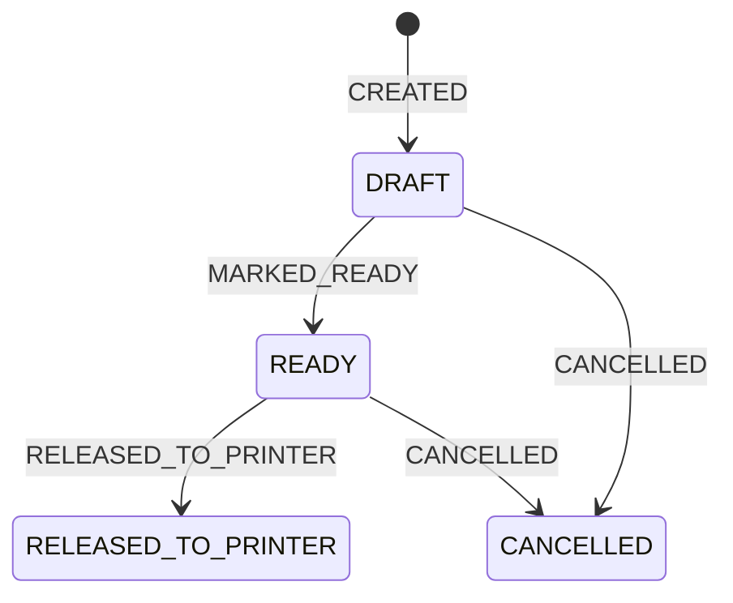

# POD production release (stage 7)

Stage 7 adds an operational release layer around the immutable manifests, asset sets, production batches, and canonical PDFs from stages 1-6. It does not mutate those records or replace `planPodImposition()`.

## Explicit print format

- New checkout items resolve `card_designs.print_format_id` through the reviewed server registry in `src/lib/podPrintFormats.ts`.
- Unknown or missing values fail closed. Client geometry and client-only format identifiers are ignored.
- The resolved ID is copied to the order item and every newly created `inventory_unit`.
- Manifest version 2 records `format_source: inventory_unit` for explicit records.
- Existing units without `print_format_id` use only `legacy_fallback_v1`, are visibly marked in the canonical manifest and batch, and produce a readiness warning.
- Manifest version 1 remains readable for archived data and exact-byte reprints. It is never rewritten.

Before accepting new orders, set every active design's `print_format_id` to a value present in the registry. The current reviewed value is `postcard-148x105-v1`.

## Immutable numbered proof

`POST /api/pod/production-proof` creates one content-addressed proof per registered format. The proof uses the existing production batch planner for two complete sheets and renders visible front/back numbers, sheet indices, slots, cut-pile indices, and pile positions. It contains no customer images, QR payloads, addresses, or other personal data.

Objects use:

```text
pod-production-proofs/{print_format_id}/{proof_sha256}/{pdf_sha256}.pdf
```

The create-only Firestore artifact document stores the canonical proof manifest, its SHA-256, the PDF SHA-256, and the exact Storage generation. Operational `created_at` and `created_by` fields are outside the proof hash.

Creation uses `ifGenerationMatch=0`. A `412` response is accepted only after exact hash, size, MIME, generation, and custom metadata verification. Downloads always use the recorded generation.

No endpoint automatically approves a proof. Approval requires `confirm_physical_proof: true`, a non-empty operator comment, an administrator identity, and an idempotency key. The resulting `pod_production_proof_approval_events` document is append-only.

## Release state machine



- Current state: `pod_production_releases/{release_id}`.
- Audit history: `pod_production_release_events/{event_id}`.
- Every transition creates one append-only event and updates the release in one Firestore commit.
- The update has the exact Firestore `updateTime` precondition; the event has `exists:false`.
- Event IDs derive from the release ID and caller idempotency key. Identical retries return the existing event; conflicting reuse fails.
- All reads and readiness checks finish before the atomic write. No rendering, URL fetch, GCS upload, or other external effect occurs in the write transaction.

## Readiness gate

`POST /api/pod/production-readiness` returns `READY_FOR_RELEASE` only when every check passes:

- batch exists in `FROZEN` state and its hash matches the release;
- every compatibility group has a canonical batch PDF whose exact GCS generation, hash, size, MIME, and metadata verify;
- every referenced asset set is frozen and hash-consistent;
- every asset item has a recorded GCS generation and matching immutable object metadata;
- every print format used by the batch has an immutable numbered proof and a matching manual approval event;
- Storage bucket, separate image/font allowlists and template hashes are configured; the font allowlist contains `cdn.jsdelivr.net`, while every versioned Fontsource URL/hash pair comes from the committed render-profile registry.

Legacy fallback positions do not silently disappear: readiness includes `legacy_print_format_fallback_present` as an explicit warning. Missing or inconsistent required data blocks `MARKED_READY` and `RELEASED_TO_PRINTER`.

## Client security

The Production POD panel calls only administrator-protected backend endpoints for production operations. Firestore Rules permit active administrators to read operational metadata but deny every client create, update, and delete for:

- `pod_production_proof_artifacts`
- `pod_production_proof_approval_events`
- `pod_production_releases`
- `pod_production_release_events`

The removed daily-package workflow must not be restored. It used random client IDs, direct Firestore writes, mutable PDF generation, and a client-controlled printer status.

## Physical proof checklist

For every registered `print_format_id`, print the archived numbered proof and record the operator comment after checking:

1. SRA3 portrait feed and exact sheet dimensions.
2. Short-edge duplex and correct front/back registration.
3. Face-up printer output and ascending sheet order.
4. Ascending sheet stack from top to bottom.
5. Row-major slot cutting.
6. Ascending cut-pile merge.
7. Final numbered output sequence without gaps or reversals.
8. Bleed, crop marks, registration, finishing tolerance, and physical dimensions.

Software cannot infer press tray behavior. Until a real proof is approved, the production verdict remains blocked.
